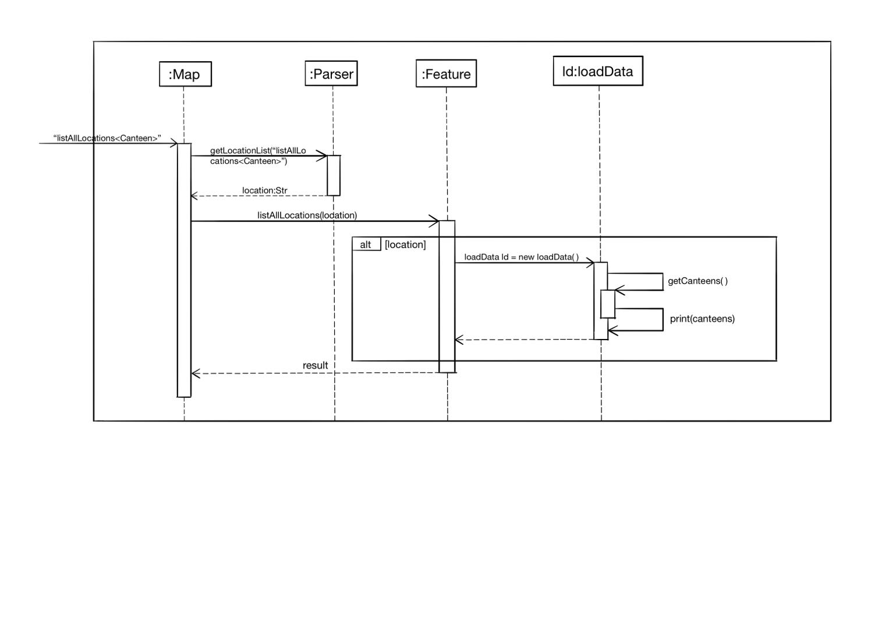

# Developer Guide

## Design & implementation

{Describe the design and implementation of the product. Use UML diagrams and short code snippets where applicable.}

## Product scope
### Target user profile

{Describe the target user profile}

### Value proposition

{Describe the value proposition: what problem does it solve?}

## User Stories

###Version 2.0

1. Find nearby libraries
   
* As a user, I can input the current location to find the nearest libraries
To get to the nearest libraries.

2. Find nearby canteens

* As a user, I can input the current location to find the nearest canteens
To get to the nearest canteen from the user’s location.

3. Find nearby lecture theatres

* As a user, I can input the current location to find the nearest lecture theatres
  To get to the nearest lecture theatres from the user’s location.

4. View all facility categories

* As a user, I can view the list of categories of facilities in the school.
so that user will know the type of facilities provided in the school
  
5. View all lecture theatres in the school
* As a user, I can view the list of all lecture theatres in the school.

6. View all canteens in the school
* As a user , I can view the list of all canteens in the school.
Get a better overview of what food there is in school

7. View all libraries in the school
* As a user, I can view the list of all libraries in the school
To know all the available libraries  in the school.

## Non-Functional Requirements

{Give non-functional requirements}

## Class diagram for v2.0

## Sequence digram for v2.0
### Sequence digram for listAllLocation

## Glossary

* *glossary item* - Definition

## Instructions for manual testing
1. Test data parser
* find the `loadDataTest` in path `tp/src/test/java/seedu/duke/loadDataTest.java`.
* run dataLoadTest.
* if the text file are not empty, the test will fail. 
