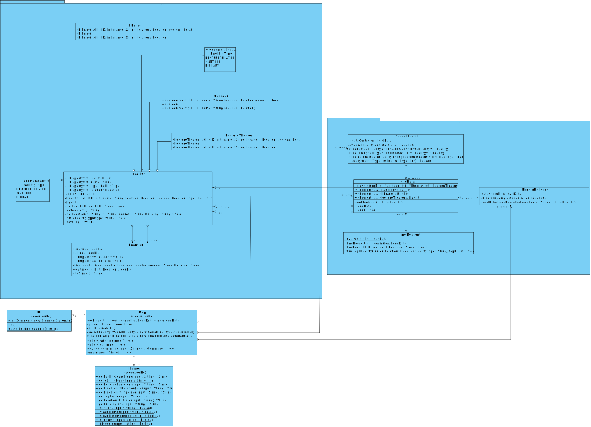
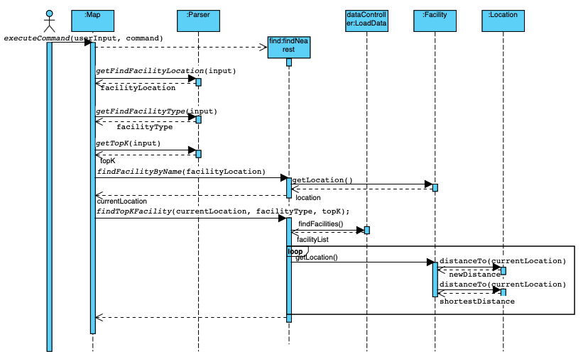
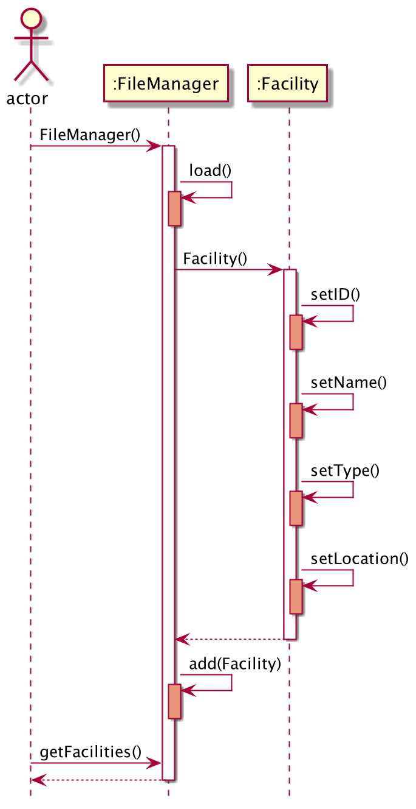

# Developer Guide

## Design & implementation

### Class diagram for v2.0

We have 4 packages in total: Control, Entity, Seedu.Duke(boundary) and exception. 
Control classes deal with the database of entity objects directly, return the wanted result after processing the database.  
Entity classes include facilities that are available to be navigated to.
Boundary classes take in user input and process the user input to pass to control class.
Exception handles common exceptions such as invalid input exception etc to make sure the system runs smoothly.

### Sequence diagram for v2.0
### Sequence diagram for listAllLocations

### Sequence digram for findNearest

### Sequence diagram for loading facility data

## Product scope
### Target user profile
Students who wish to navigate to a certain place in campus.

### Value proposition
- Help freshmen to be familiar with campus
- Find lecture theatres/canteens/libraries

## User Stories

###Version 2.0

1. Find nearby libraries
   
* As a user, I can input the current location to find the nearest libraries
To get to the nearest libraries.

2. Find nearby canteens

* As a user, I can input the current location to find the nearest canteens
To get to the nearest canteen from the user’s location.

3. Find nearby lecture theatres

* As a user, I can input the current location to find the nearest lecture theatres
  To get to the nearest lecture theatres from the user’s location.

4. View all facility categories

* As a user, I can view the list of categories of facilities in the school.
so that user will know the type of facilities provided in the school
  
5. View all lecture theatres in the school
* As a user, I can view the list of all lecture theatres in the school.

6. View all canteens in the school
* As a user , I can view the list of all canteens in the school.
Get a better overview of what food there is in school

7. View all libraries in the school
* As a user, I can view the list of all libraries in the school
To know all the available libraries  in the school.

## Non-Functional Requirements

{Give non-functional requirements}

## Glossary

* *glossary item* - Definition

## Instructions for manual testing
1. Test data parser
* find the `loadDataTest` in path `tp/src/test/java/seedu/duke/loadDataTest.java`.
* run dataLoadTest.
* if the text file are empty, the test will fail. 

## Instructions for logging
### The following data are logged:
1. User Inputs
2. All error handling messages

## Instructions for building jar
run the `shadowJar` in `build.gradle` script. And the output jar will be stored in `build\libs`.